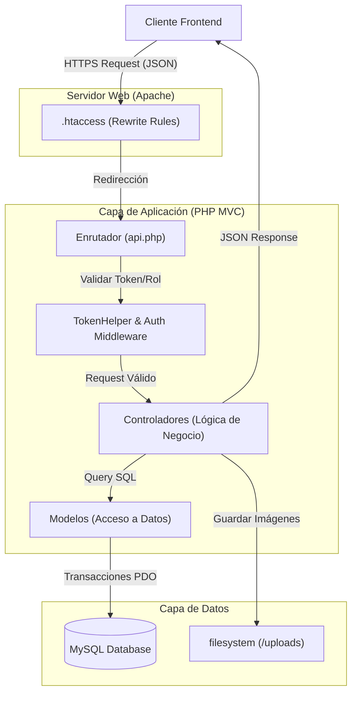

# 🛡️ Sistema de Gestión de Incidencias e Inventario TI (Backend)


> **Desarrollado por:** Ing. Roberth Rios Jesus  
> **Ingeniero de Sistemas Colegiado (CIP 321353)**

Este repositorio aloja el código fuente del **Backend** para el sistema de gestión de la **Municipalidad Provincial de Pomabamba**. 

Más que un simple CRUD, este proyecto es una implementación robusta de una **Arquitectura MVC en PHP Nativo**, diseñada para demostrar competencias avanzadas en Ingeniería de Software, seguridad informática (JWT + RBAC) y diseño de bases de datos relacionales complejas, priorizando el rendimiento y el control total sobre el código sin la dependencia de frameworks pesados.

---

## 📋 Características Clave

### 🏗️ Arquitectura Limpia & Escalable
* **Diseño Modular:** Basado estrictamente en el patrón **MVC (Modelo-Vista-Controlador)**.
* **Separación de Responsabilidades:** Distinción clara entre lógica de negocio, acceso a datos y enrutamiento.

### 🔐 Seguridad de Grado Corporativo
* **Autenticación JWT Manual:** Estrategia dual de *Access Tokens* (corto plazo) y *Refresh Tokens* (rotativos).
* **Sistema de Blacklist:** Mecanismo para la invalidación inmediata de tokens al cerrar sesión (Logout seguro).
* **RBAC (Role-Based Access Control):** Middleware personalizado para proteger rutas según el perfil del usuario (Admin, Técnico, Usuario).

### 💻 Gestión Integral de Activos (ITSM)
* **Trazabilidad Completa:** Lógica compleja para el seguimiento de equipos, componentes internos y periféricos.
* **Auditoría:** Historial detallado de cambios de estado en las incidencias reportadas.

### ⚡ Optimización de Datos
* **Seguridad SQL:** Uso estricto de **PDO con Sentencias Preparadas** para prevención total de SQL Injection.
* **Listados Eficientes:** Paginación nativa y filtrado dinámico en todos los endpoints.
* **Gestión de Media:** Carga de imágenes optimizada con validación estricta de tipos MIME y dimensiones en el servidor.

---

## 🛠️ Stack Tecnológico

| Área | Tecnología / Herramienta |
| :--- | :--- |
| **Lenguaje Core** | PHP 8.x (Nativo) |
| **Arquitectura** | RESTful API / MVC |
| **Base de Datos** | MySQL / MariaDB (Motor InnoDB) |
| **ORM / DAO** | PDO (PHP Data Objects) Nativo |
| **Seguridad** | `firebase/php-jwt` (Firma), `Bcrypt` (Hashing) |
| **Servidor Web** | Apache (con `.htaccess` Rewrite Rules) |
| **Dependencias** | Composer, `vlucas/phpdotenv` |

---

## f🏗️ Arquitectura de la Solución

El sistema opera bajo un modelo de **API RESTful** que centraliza la lógica de negocio y seguridad, sirviendo datos agnósticos a cualquier cliente frontend (Web o Móvil).



## 🚀 Instalación y Uso Local
Sigue estos pasos para desplegar el entorno de desarrollo:

1. **Clonar el repositorio**

```bash

git clone https://github.com/Roberthrjr/gestion_incidencias_backend.git
cd gestion_incidencias_backend

```

2. **Instalar dependencias**
Asegúrate de tener Composer instalado.

```bash

composer install

```

3. **Configuración de Variables de Entorno**
Renombra el archivo `.env.example` a `.env` y configura tus credenciales:

```ini
DB_HOST=localhost
DB_NAME=gestion_incidencias_mp
DB_USER=root
DB_PASS=tu_contraseña
SECRET_KEY="tu_clave_super_secreta_para_jwt"
```

4. **Base de Datos**
Importa el script SQL ubicado en database/dump.sql en tu servidor MySQL/MariaDB para crear las tablas y relaciones.

5. **Ejecutar servidor**
Si no utilizas Apache (XAMPP/Laragon), puedes levantar el servidor interno de PHP:

```bash

php -S localhost:8000 -t public

```
## 📂 Estructura del Proyecto

```
Plaintext

/
├── config/             # Configuración de BD y carga de entorno (.env)
├── controllers/        # Lógica de negocio (Endpoints y respuesta JSON)
├── models/             # DAO, Validaciones y Consultas SQL directas
├── public/             # Entry Point (index.php) y Assets públicos
│   └── uploads/        # Almacenamiento de evidencias/fotos
├── routes/             # Definición de rutas y verbos HTTP
├── utils/              # Helpers (TokenHelper, Validadores, Formateadores)
├── vendor/             # Librerías de terceros (Composer)
└── .env                # Variables de entorno (Sensible - No versionar)
```
## 📬 Contacto

Si tienes alguna pregunta sobre la arquitectura o deseas contactarme por motivos profesionales:

* **LinkedIn:** [Roberth Rios Jesus](https://linkedin.com/in/roberthrjr)
* **GitHub:** [Roberthrjr](https://github.com/Roberthrjr)
* **Email:** tauroroberth00@gmail.com

---

© 2025 Roberth Rios Jesus. Desarrollado con ❤️ y desplegado en AWS.